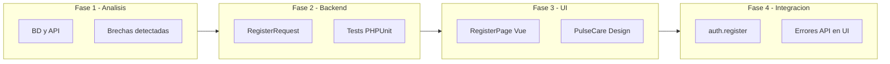
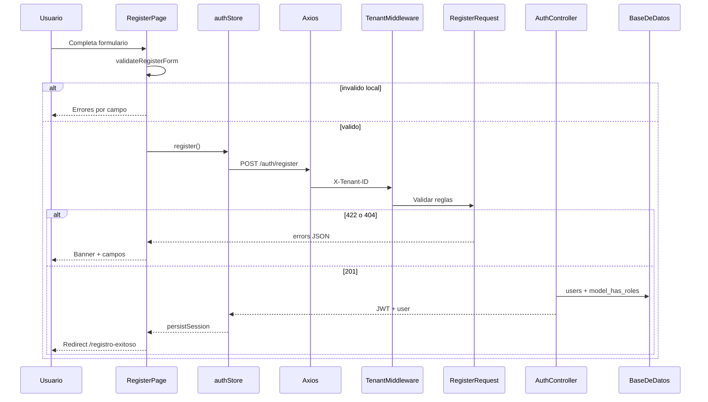
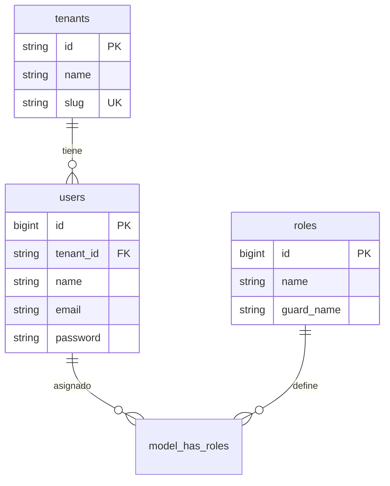

# Sprint completo — Módulo Registro de usuarios

**Proyecto:** Hospital HIS — Evaluación Final Análisis de Sistemas I  
**Módulo asignado:** Registro de usuarios  
**Estado:** Completado  
**Stack:** Laravel 12 · Vue 3 · JWT · Multitenancy · Tailwind CSS 4

---

## Índice

1. [Resumen ejecutivo](#1-resumen-ejecutivo)
2. [Objetivo del módulo](#2-objetivo-del-módulo)
3. [Fases del sprint](#3-fases-del-sprint)
4. [Arquitectura](#4-arquitectura)
5. [Base de datos](#5-base-de-datos)
6. [API — Registro](#6-api--registro)
7. [Backend implementado](#7-backend-implementado)
8. [Frontend implementado](#8-frontend-implementado)
9. [UI/UX — PulseCare Medical](#9-uiux--pulsecare-medical)
10. [Rutas de la aplicación](#10-rutas-de-la-aplicación)
11. [Validaciones](#11-validaciones)
12. [Inventario de archivos](#12-inventario-de-archivos)
13. [Pruebas](#13-pruebas)
14. [Cómo ejecutar el proyecto](#14-cómo-ejecutar-el-proyecto)
15. [Historias de usuario cumplidas](#15-historias-de-usuario-cumplidas)
16. [Decisiones técnicas](#16-decisiones-técnicas)
17. [Limitaciones y trabajo futuro](#17-limitaciones-y-trabajo-futuro)
18. [Documentación relacionada](#18-documentación-relacionada)

---

## 1. Resumen ejecutivo

Se implementó el **módulo completo de registro de usuarios** para un sistema hospitalario multitenancy. Un visitante puede crear cuenta en un hospital (tenant), recibir rol `Recepcionista`, obtener JWT automáticamente y acceder al sistema.

| Entregable | Estado |
|------------|--------|
| Análisis de BD y API existente | Completado |
| Validaciones backend (Form Request + español) | Completado |
| UI/UX formulario PulseCare Medical | Completado |
| Integración frontend ↔ backend | Completado |
| Tests automatizados (12 casos) | Completado |
| Guía de pruebas manuales | Completado |

**URL de la app:** http://127.0.0.1:8000/  
**Tenant demo:** `00000000-0000-4000-8000-000000000001`

---

## 2. Objetivo del módulo

Implementar o mejorar el **formulario de registro**, **validaciones** y **mensajes de respuesta**, permitiendo que un usuario se registre dentro de un hospital (tenant) y quede autenticado de inmediato.

### Flujo de negocio

```
Visitante → Formulario registro (/)
         → Validación cliente + servidor
         → Usuario creado en BD + rol Recepcionista
         → JWT emitido
         → Pantalla de éxito (/registro-exitoso)
         → "Registrar otro paciente" → vuelve a /
```

---

## 3. Fases del sprint



| Fase | Alcance | Documento de referencia |
|------|---------|-------------------------|
| **1 — Análisis** | Tablas, API, brechas, backlog | [sprint-01-registro-usuarios/README.md](../sprint-01-registro-usuarios/README.md) |
| **2 — Backend** | Form Request, validaciones ES, tests | [sprint-02-registro-backend/README.md](../sprint-02-registro-backend/README.md) |
| **3 — UI/UX** | RegisterPage, AuthPageShell, Tailwind PulseCare | Este documento §9 |
| **4 — Integración** | Pinia + Axios + mapeo errores + redirect | Este documento §8 |
| **5 — UML** | Diagramas de clases y secuencia | [sprint-03-registro-uml/README.md](../sprint-03-registro-uml/README.md) |

---

## 4. Arquitectura

### Vista general

| Capa | Tecnología | Rol en registro |
|------|------------|-----------------|
| Frontend | Vue 3 + Pinia + Vue Router | Formulario, validación local, llamada API |
| Cliente HTTP | Axios | `POST /auth/register` + `X-Tenant-ID` |
| Backend | Laravel 12 | Validación, persistencia, JWT |
| Auth | tymon/jwt-auth | Token tras registro exitoso |
| RBAC | spatie/laravel-permission | Rol seleccionable al registrar |
| Multitenancy | TenantMiddleware | Tenant por cabecera `X-Tenant-ID` |

### Flujo end-to-end



---

## 5. Base de datos

### Tablas involucradas



### Restricciones clave

- **`UNIQUE (tenant_id, email)`** — el mismo correo puede existir en hospitales distintos, no duplicado en el mismo.
- **Rol por defecto:** `Recepcionista` (asignado en `AuthController@register`).

### Datos demo (seeder)

| Campo | Valor |
|-------|-------|
| `id` | `00000000-0000-4000-8000-000000000001` |
| `slug` | `san-marcos-demo` |
| `name` | Hospital General San Marcos (demo) |

---

## 6. API — Registro

### Endpoint

```
POST /api/v1/auth/register
```

| Cabecera | Obligatoria | Descripción |
|----------|-------------|-------------|
| `Content-Type` | Sí | `application/json` |
| `Accept` | Sí | `application/json` |
| `X-Tenant-ID` | Sí | UUID del hospital |

### Request body

```json
{
  "name": "María López",
  "email": "maria@example.com",
  "password": "Password1!",
  "password_confirmation": "Password1!"
}
```

### Respuestas

| HTTP | Situación | Ejemplo |
|------|-----------|---------|
| **201** | Registro OK | `{ "access_token", "user", "expires_in" }` |
| **400** | Sin `X-Tenant-ID` | `"La cabecera X-Tenant-ID es obligatoria."` |
| **404** | Tenant inexistente | `"Tenant no encontrado."` |
| **422** | Validación fallida | `{ "message", "errors": { "campo": ["..."] } }` |

---

## 7. Backend implementado

### RegisterRequest

**Archivo:** `app/Http/Requests/Api/V1/RegisterRequest.php`

- Reglas centralizadas con mensajes en **español**
- Normalización: `trim(name)`, `lowercase(trim(email))`
- Email único scoped por `tenant_id`

### AuthController

**Archivo:** `app/Http/Controllers/Api/V1/AuthController.php`

- Usa `RegisterRequest` en lugar de validación inline
- Password hasheado por cast `'hashed'` del modelo `User`
- Asigna rol `Recepcionista` y emite JWT

### Ruta

**Archivo:** `routes/api.php`

```php
Route::middleware('tenant')->group(function (): void {
    Route::post('/auth/register', [AuthController::class, 'register']);
});
```

---

## 8. Frontend implementado

### Store Pinia — `register()`

**Archivo:** `resources/js/stores/auth.js`

```javascript
async register({ name, email, password, passwordConfirmation, tenantId }) {
    this.setTenantId(tenantId);
    const { data } = await api.post('/auth/register', {
        name, email, password,
        password_confirmation: passwordConfirmation,
    });
    this.persistSession(data);
    return data;
}
```

### RegisterPage

**Archivo:** `resources/js/modules/auth/pages/RegisterPage.vue`

- Validación local antes de llamar al API
- Mapeo de errores 422 → campos del formulario
- Error 404 tenant → banner global + campo tenant
- Éxito → redirect a `/registro-exitoso`

### RegisterSuccessPage

**Archivo:** `resources/js/modules/auth/pages/RegisterSuccessPage.vue`

- Resumen del paciente registrado (nombre, email, rol)
- Botón **"Registrar otro paciente"** → `clearSession()` + vuelve a `/`
- Sin pantalla de inicio ni login en el flujo

### Composable de validación

**Archivo:** `resources/js/modules/auth/composables/useRegisterValidation.js`

- `validateRegisterForm()` — reglas cliente (alineadas al backend)
- `mapApiErrors()` — convierte respuesta Laravel 422 a errores UI

### Layout auth

**Archivo:** `resources/js/modules/auth/layouts/AuthPageShell.vue`

- Fondo patrón médico, contenedor centrado, slot para alertas

---

## 9. UI/UX — PulseCare Medical

Diseño basado en referencia **PulseCare Medical Systems**:

| Elemento | Implementación |
|----------|----------------|
| Marca | Logo `medical_services` + "PulseCare Medical" |
| Card | Bordes redondeados 24px, icono `security` |
| Colores | Tokens PulseCare en `resources/css/app.css` |
| Tipografía | Inter (Google Fonts) |
| Iconos | Material Symbols Outlined |
| Campos | 5 inputs + toggle visibilidad contraseña |
| Feedback | Banner éxito (verde) / error (rojo) animado |
| Footer | HIPAA Compliant + enlaces legales |

### Campos del formulario

| # | Etiqueta | Campo API | Notas |
|---|----------|-----------|-------|
| 1 | ID de tenant (UUID) | Cabecera `X-Tenant-ID` | Precargado con tenant demo |
| 2 | Nombre completo | `name` | Mín. 2 caracteres |
| 3 | Correo electrónico | `email` | Único por hospital |
| 4 | Contraseña | `password` | Fuerte: 8+ chars, mixed case, número, símbolo |
| 5 | Confirmar contraseña | `password_confirmation` | Debe coincidir |

---

## 10. Rutas de la aplicación

| Ruta Vue | Componente | Descripción |
|----------|------------|-------------|
| `/` | `RegisterPage` | **Pantalla principal — Registro** |
| `/registro-exitoso` | `RegisterSuccessPage` | Confirmación + registrar otro paciente |
| `/register` | redirect → `/` | Alias |
| `/inicio`, `/login`, otras | redirect → `/` | Fuera del flujo del módulo |

> **Importante:** La SPA se sirve desde **Laravel** (`http://127.0.0.1:8000`). El puerto `:5173` es solo el servidor de assets Vite (hot reload).

---

## 11. Validaciones

### Servidor (`RegisterRequest`)

| Campo | Reglas |
|-------|--------|
| `name` | required, min:2, max:255, regex letras/espacios/guiones/apóstrofes |
| `email` | required, email:rfc, max:255, unique por tenant_id |
| `password` | required, confirmed, Password::min(8)->mixedCase()->numbers()->symbols() |

### Cliente (`validateRegisterForm`)

Validación equivalente en el navegador para evitar requests innecesarios y dar feedback inmediato en blur/submit.

### Mensajes en español (ejemplos)

- `"El correo electrónico ya está registrado en este hospital."`
- `"Las contraseñas no coinciden."`
- `"La contraseña debe tener al menos 8 caracteres e incluir mayúsculas, minúsculas, números y un símbolo."`

---

## 12. Inventario de archivos

### Backend

| Archivo | Acción |
|---------|--------|
| `app/Http/Requests/Api/V1/RegisterRequest.php` | Creado |
| `app/Http/Controllers/Api/V1/AuthController.php` | Modificado |
| `routes/api.php` | Sin cambio (ruta ya existía) |
| `tests/Feature/AuthRegisterTest.php` | Creado |

### Frontend

| Archivo | Acción |
|---------|--------|
| `resources/js/modules/auth/pages/RegisterPage.vue` | Creado |
| `resources/js/modules/auth/pages/RegisterSuccessPage.vue` | Creado |
| `resources/js/modules/auth/layouts/AuthPageShell.vue` | Creado |
| `resources/js/modules/auth/composables/useRegisterValidation.js` | Creado |
| `resources/js/stores/auth.js` | Modificado (`register()`) |
| `resources/js/router/index.js` | Modificado (rutas) |
| `resources/js/App.vue` | Modificado (layout auth) |
| `resources/js/modules/auth/pages/LoginPage.vue` | Modificado (enlace registro) |
| `resources/js/shared/components/AppLayout.vue` | Modificado (nav) |
| `resources/css/app.css` | Modificado (tokens PulseCare) |
| `resources/views/app.blade.php` | Modificado (fuentes) |
| `vite.config.js` | Modificado (redirect 5173→8000) |

### Documentación

| Archivo | Contenido |
|---------|-----------|
| `docs/sprints/registro-usuarios/README.md` | **Este documento — sprint completo** |
| `docs/sprints/sprint-01-registro-usuarios/README.md` | Análisis inicial |
| `docs/sprints/sprint-02-registro-backend/README.md` | Detalle backend |
| `docs/sprints/sprint-02-registro-backend/PRUEBAS.md` | Guía de pruebas |

---

## 13. Pruebas

### Automatizadas

```bash
php artisan test --filter=AuthRegister
```

**12 tests — 48 assertions**

| Tipo | Cantidad | Ejemplos |
|------|----------|----------|
| Positivos | 3 | Registro OK, email otro tenant, normalización email |
| Fallidos | 9 | Duplicado, contraseña débil, tenant inválido, campos vacíos |

### Manuales

Guía completa con casos UI y cURL: **[PRUEBAS.md](../sprint-02-registro-backend/PRUEBAS.md)**

#### Casos positivos (UI)

| ID | Acción | Resultado |
|----|--------|-----------|
| P1 | Registro con datos válidos | Redirect a `/registro-exitoso` |
| P2 | Email con mayúsculas | Guardado en minúsculas |
| P3 | "Registrar otro paciente" | Vuelve a `/` con formulario limpio |

#### Casos fallidos (UI)

| ID | Acción | Resultado |
|----|--------|-----------|
| F1 | Tenant UUID inexistente | Banner "Tenant no encontrado." |
| F2 | Email duplicado | Error en campo email |
| F3 | Contraseña `password` | Error en password |
| F4 | Confirmación distinta | "Las contraseñas no coinciden." |

---

## 14. Cómo ejecutar el proyecto

```bash
# Terminal 1 — Backend (obligatorio)
php artisan serve

# Terminal 2 — Hot reload frontend
npm run dev
```

Abrir: **http://127.0.0.1:8000/**

### Prueba rápida de registro

1. Tenant: `00000000-0000-4000-8000-000000000001`
2. Nombre: `María López`
3. Email: `nuevo@example.com` (único)
4. Contraseña: `Password1!` (confirmar igual)
5. Clic en **Registrarse** → redirect a `/inicio`

---

## 15. Historias de usuario cumplidas

| ID | Historia | Criterio | Estado |
|----|----------|----------|--------|
| US-01 | Registrarme con nombre, email y contraseña | POST register + JWT | Cumplido |
| US-02 | Ver errores claros si datos inválidos | Mensajes ES por campo | Cumplido |
| US-03 | Saber si email ya está registrado | 422 con mensaje específico | Cumplido |
| US-04 | Confirmación visual tras registro exitoso | Cumplido |
| US-05 | Registrar otro paciente sin salir del módulo | Cumplido |
| US-06 | UI profesional dominio médico (PulseCare) | Cumplido |

---

## 16. Decisiones técnicas

| Decisión | Elección | Motivo |
|----------|----------|--------|
| Validación backend | Form Request dedicado | Separación, testeable, mensajes ES |
| Email | `email:rfc` sin DNS | Estable en tests sin red |
| Unique email | Por `tenant_id` | Alineado a restricción BD |
| Contraseña | Reglas fuertes Laravel | Seguridad mínima del módulo |
| Rol al registrar | `Recepcionista` fijo | Regla de negocio base del proyecto |
| Ruta principal `/` | Registro | Requerimiento del módulo |
| URL desarrollo | `:8000` no `:5173` | Laravel monta la SPA |
| Validación dual | Cliente + servidor | UX rápida + seguridad real |

---

## 17. Limitaciones y trabajo futuro

| Item | Descripción |
|------|-------------|
| Verificación de email | No implementada |
| Selección de rol al registrar | Rol fijo `Recepcionista` |
| Flujo UI | Solo registro + éxito | Alcance del módulo asignado |
| Post-registro | Pantalla dedicada `/registro-exitoso` | UX clara para registrar otro paciente |
| Tests E2E browser | Solo PHPUnit + manual |
| i18n global | Mensajes ES en Form Request, no en `lang/` |

---

## 18. Documentación relacionada

| Documento | Enlace |
|-----------|--------|
| Análisis Sprint 1 | [sprint-01-registro-usuarios/README.md](../sprint-01-registro-usuarios/README.md) |
| Sprint 2 (implementación) | [sprint-02-registro-backend/README.md](../sprint-02-registro-backend/README.md) |
| **Sprint 3 (UML)** | [sprint-03-registro-uml/README.md](../sprint-03-registro-uml/README.md) |
| Guía de pruebas | [sprint-02-registro-backend/PRUEBAS.md](../sprint-02-registro-backend/PRUEBAS.md) |
| README proyecto | [README.md](../../README.md) (raíz) |

---

*Sprint completo — Módulo Registro de usuarios. Hospital HIS · PulseCare Medical.*
