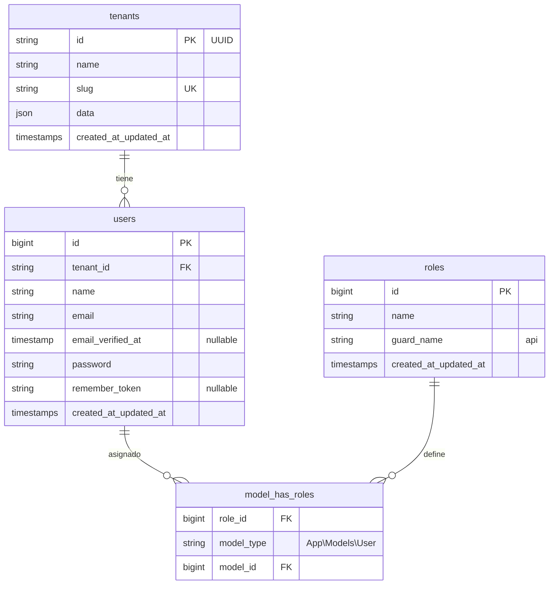

# Sprint 1 — Registro de usuarios

**Módulo asignado:** Registro de usuarios  
**Objetivo del sprint:** Implementar o mejorar el formulario de registro, validaciones y mensajes de respuesta (frontend + backend).  
**Estado actual:** Análisis y documentación base — el backend tiene un endpoint funcional mínimo; el frontend **no tiene pantalla de registro**.

---

## 1. Contexto del módulo

El registro de usuarios permite que una persona se cree una cuenta dentro de un **tenant** (hospital). Cada usuario queda asociado a un tenant, recibe un **rol** inicial y obtiene un **JWT** para autenticarse de inmediato.

Flujo esperado al completar el sprint:

```
Usuario → Formulario Vue (/register)
       → POST /api/v1/auth/register + X-Tenant-ID
       → Validación backend
       → INSERT en users + rol en model_has_roles
       → Respuesta JSON (201) con token y datos del usuario
       → Redirección a home (sesión persistida)
```

---

## 2. Base de datos

### 2.1 Diagrama entidad-relación (tablas relevantes)



### 2.2 Tabla `tenants`

| Columna      | Tipo        | Restricciones | Descripción                          |
|--------------|-------------|---------------|--------------------------------------|
| `id`         | string      | PK            | UUID del tenant                      |
| `name`       | string      | NOT NULL      | Nombre del hospital / institución    |
| `slug`       | string      | UNIQUE        | Identificador legible (URL-friendly) |
| `data`       | json        | NULL          | Metadatos extensibles (Stancl)       |
| `created_at` | timestamp   |               |                                      |
| `updated_at` | timestamp   |               |                                      |

**Migración:** `database/migrations/0001_01_01_000000_create_tenants_table.php`

**Datos demo (seeder):**

| Campo  | Valor                                              |
|--------|----------------------------------------------------|
| `id`   | `00000000-0000-4000-8000-000000000001`             |
| `slug` | `san-marcos-demo`                                  |
| `name` | Hospital General San Marcos (demo)                 |

---

### 2.3 Tabla `users` (principal para el registro)

| Columna             | Tipo        | Restricciones                    | Uso en registro              |
|---------------------|-------------|----------------------------------|------------------------------|
| `id`                | bigint      | PK, auto-increment               | Generado automáticamente     |
| `tenant_id`         | string      | FK → `tenants.id`, CASCADE       | Tomado del middleware tenant |
| `name`              | string      | NOT NULL                         | Campo del formulario         |
| `email`             | string      | NOT NULL                         | Campo del formulario         |
| `email_verified_at` | timestamp   | NULL                             | No usado aún en registro     |
| `password`          | string      | NOT NULL                         | Hash bcrypt/argon            |
| `remember_token`    | string      | NULL                             | No usado en API JWT          |
| `created_at`        | timestamp   |                                  |                              |
| `updated_at`        | timestamp   |                                  |                              |

**Restricción crítica:** `UNIQUE (tenant_id, email)` — el mismo correo puede existir en tenants distintos, pero **no duplicado dentro del mismo tenant**.

**Migración:** `database/migrations/0001_01_01_000001_create_users_table.php`

**Modelo Eloquent:** `app/Models/User.php`

- `$fillable`: `tenant_id`, `name`, `email`, `password`
- Traits: `HasRoles` (Spatie), JWT (`JWTSubject`)
- Relación: `belongsTo(Tenant::class)`
- Cast: `password` → hashed automáticamente

---

### 2.4 Tablas de roles (Spatie Permission)

El registro asigna un rol al crear el usuario. Tablas involucradas:

| Tabla               | Propósito                                      |
|---------------------|------------------------------------------------|
| `roles`             | Catálogo de roles (`guard_name = api`)         |
| `model_has_roles`   | Pivot usuario ↔ rol                            |
| `permissions`       | Permisos (no se usan en registro actual)       |
| `model_has_permissions` | Pivot usuario ↔ permiso                    |
| `role_has_permissions`  | Pivot rol ↔ permiso                        |

**Migración:** `database/migrations/0001_01_01_000004_create_permission_tables.php`

**Roles precargados** (`database/seeders/RoleSeeder.php`):

- Admin
- Médico
- Enfermera
- TecnicoLab
- Recepcionista

**Comportamiento actual en registro:** todo usuario nuevo recibe el rol **`Recepcionista`** de forma fija (`AuthController@register`).

---

### 2.5 Tablas auxiliares (no usadas directamente en registro)

| Tabla                    | Relación con registro                          |
|--------------------------|------------------------------------------------|
| `password_reset_tokens`  | Recuperación de contraseña (futuro)            |
| `sessions`               | Sesiones web (SPA usa JWT, no sesión API)      |
| `cache`, `jobs`          | Infraestructura Laravel                        |

---

## 3. API — Registro de usuarios

### 3.1 Endpoint

| Método | Ruta                    | Auth | Middleware        |
|--------|-------------------------|------|-------------------|
| POST   | `/api/v1/auth/register` | No   | `tenant`          |

**Definición:** `routes/api.php`  
**Controlador:** `app/Http/Controllers/Api/V1/AuthController.php` → método `register()`

### 3.2 Cabeceras requeridas

| Cabecera         | Obligatoria | Descripción                          |
|------------------|-------------|--------------------------------------|
| `Content-Type`   | Sí          | `application/json`                   |
| `Accept`         | Sí          | `application/json`                   |
| `X-Tenant-ID`    | Sí          | UUID del tenant donde se registra    |

Si falta `X-Tenant-ID` → **400**  
Si el tenant no existe → **404**

### 3.3 Cuerpo de la petición (request)

```json
{
  "name": "María López",
  "email": "maria@example.com",
  "password": "password123",
  "password_confirmation": "password123"
}
```

### 3.4 Validaciones actuales (backend)

| Campo                  | Reglas actuales                              | Observación                          |
|------------------------|----------------------------------------------|--------------------------------------|
| `name`                 | required, string, max:255                    | OK                                   |
| `email`                | required, email, max:255                     | **Falta** regla `unique` por tenant  |
| `password`             | required, string, min:8, confirmed           | OK                                   |
| `password_confirmation`| (implícito por `confirmed`)                  | Debe enviarse en el body             |

**Brecha detectada:** si el email ya existe en el tenant, la BD lanza error de integridad en lugar de un **422** con mensaje amigable. Esto debe corregirse en el sprint.

### 3.5 Respuesta exitosa — 201 Created

```json
{
  "access_token": "eyJ0eXAiOiJKV1QiLCJhbGc...",
  "token_type": "bearer",
  "expires_in": 3600,
  "user": {
    "id": 1,
    "tenant_id": "00000000-0000-4000-8000-000000000001",
    "name": "María López",
    "email": "maria@example.com",
    "email_verified_at": null,
    "created_at": "2026-06-13T12:00:00.000000Z",
    "updated_at": "2026-06-13T12:00:00.000000Z",
    "roles": [
      { "id": 5, "name": "Recepcionista", "guard_name": "api", ... }
    ],
    "tenant": {
      "id": "00000000-0000-4000-8000-000000000001",
      "name": "Hospital General San Marcos (demo)",
      "slug": "san-marcos-demo",
      ...
    }
  }
}
```

### 3.6 Respuestas de error actuales

| HTTP | Origen                    | Ejemplo de `message` / `errors`                    |
|------|---------------------------|------------------------------------------------------|
| 400  | TenantMiddleware          | `"La cabecera X-Tenant-ID es obligatoria."`          |
| 404  | TenantMiddleware          | `"Tenant no encontrado."`                            |
| 422  | Validación Laravel        | `{ "errors": { "email": ["..."], "password": ["..."] } }` |
| 500  | Email duplicado (actual)  | Error SQL por UNIQUE — **a corregir en sprint**      |

### 3.7 Ejemplo con cURL

```bash
curl -X POST http://127.0.0.1:8000/api/v1/auth/register \
  -H "Content-Type: application/json" \
  -H "Accept: application/json" \
  -H "X-Tenant-ID: 00000000-0000-4000-8000-000000000001" \
  -d "{\"name\":\"María López\",\"email\":\"maria@example.com\",\"password\":\"password123\",\"password_confirmation\":\"password123\"}"
```

---

## 4. Frontend — Estado actual

### 4.1 Archivos relevantes

| Archivo                                          | Rol actual                                      |
|--------------------------------------------------|-------------------------------------------------|
| `resources/js/modules/auth/pages/LoginPage.vue`  | Solo login (tenant, email, password)            |
| `resources/js/stores/auth.js`                    | `login()`, `logout()` — **sin `register()`**    |
| `resources/js/plugins/axios.js`                  | Inyecta `Authorization` y `X-Tenant-ID`         |
| `resources/js/router/index.js`                   | Rutas `/` y `/login` — **sin `/register`**      |
| `resources/js/router/guards.js`                  | Redirige guests con token a home                |

### 4.2 Brechas en frontend

- [ ] No existe `RegisterPage.vue`
- [ ] No hay ruta `/register` en Vue Router
- [ ] No hay acción `register()` en Pinia store
- [ ] No hay enlace "¿No tienes cuenta? Regístrate" en login
- [ ] No hay manejo de errores 422 campo a campo (solo mensaje genérico en login)
- [ ] No hay mensajes de éxito tras registro

### 4.3 Referencia de UX (LoginPage existente)

El login ya define el patrón visual a reutilizar:

- Formulario centrado, max-width 420px
- Campos: tenant ID, email, password
- Estado `loading`, `errorMessage`
- Errores desde `error.response.data.message` o `errors.email[0]`

El registro debería extender este patrón con: **nombre**, **confirmar contraseña** y feedback por campo.

---

## 5. Archivos del backend a tocar en este sprint

| Archivo | Cambio esperado |
|---------|-----------------|
| `app/Http/Controllers/Api/V1/AuthController.php` | Mejorar validaciones, mensajes en español, regla unique por tenant |
| `app/Models/User.php` | Posible Form Request o reglas adicionales (opcional) |
| `tests/Feature/AuthRegisterTest.php` | **Crear** — tests del endpoint de registro |

**Archivos que probablemente NO cambien:**

- `routes/api.php` — la ruta ya existe
- Migraciones — el esquema actual es suficiente para el sprint
- `TenantMiddleware.php` — ya resuelve el tenant

---

## 6. Archivos del frontend a crear/modificar

| Acción   | Archivo |
|----------|---------|
| Crear    | `resources/js/modules/auth/pages/RegisterPage.vue` |
| Modificar| `resources/js/stores/auth.js` → agregar `register()` |
| Modificar| `resources/js/router/index.js` → ruta `/register` |
| Modificar| `resources/js/modules/auth/pages/LoginPage.vue` → enlace a registro |

---

## 7. Backlog del Sprint 1

### Historias de usuario

| ID   | Historia | Criterio de aceptación |
|------|----------|------------------------|
| US-01 | Como visitante quiero registrarme con nombre, email y contraseña | Formulario envía POST register y recibo JWT |
| US-02 | Como visitante quiero ver errores claros si los datos son inválidos | Campos inválidos muestran mensaje en español |
| US-03 | Como visitante quiero saber si el email ya está registrado | Backend responde 422 con mensaje específico |
| US-04 | Como usuario registrado quiero entrar directamente al sistema | Tras 201, token guardado y redirect a `/` |

### Tareas técnicas sugeridas

#### Backend
- [ ] Agregar validación `unique:users,email,NULL,id,tenant_id,{tenant_id}`
- [ ] Personalizar mensajes de validación en español
- [ ] (Opcional) Extraer reglas a `RegisterRequest` Form Request
- [ ] Crear tests Feature: registro OK, email duplicado, tenant inválido, password corta

#### Frontend
- [ ] Crear `RegisterPage.vue` con campos: tenant, name, email, password, password_confirmation
- [ ] Validación básica en cliente (required, email format, password match)
- [ ] Implementar `auth.register()` en Pinia
- [ ] Registrar ruta `/register` con meta `{ guest: true }`
- [ ] Mostrar errores 422 por campo
- [ ] Mensaje de éxito / redirect automático a home
- [ ] Enlace cruzado login ↔ registro

---

## 8. Reglas de negocio acordadas (base del proyecto)

1. **Multitenancy por cabecera:** cada petición de registro debe incluir `X-Tenant-ID`.
2. **Email único por tenant:** no por sistema global.
3. **Rol por defecto:** `Recepcionista` (hardcoded hoy; evaluar si el sprint debe permitir elegir rol).
4. **Autenticación inmediata:** el registro devuelve JWT; no hay paso de verificación de email.
5. **Contraseña mínima:** 8 caracteres + confirmación obligatoria.

---

## 9. Cómo probar durante el sprint

### Prerrequisitos

```bash
php artisan serve          # Terminal 1 — http://127.0.0.1:8000
npm run dev                # Terminal 2 — http://localhost:5173
```

### Tenant demo

```
X-Tenant-ID: 00000000-0000-4000-8000-000000000001
```

### Checklist manual

- [ ] Registro con datos válidos → 201 + token
- [ ] Mismo email en mismo tenant → error claro (422)
- [ ] Mismo email en otro tenant → debería permitirse (si hay otro tenant)
- [ ] Password &lt; 8 caracteres → 422
- [ ] Password sin confirmación coincidente → 422
- [ ] Sin X-Tenant-ID → 400
- [ ] Tenant inexistente → 404
- [ ] Tras registro, GET `/auth/me` con el token → datos del usuario + rol Recepcionista

### Comandos útiles

```bash
php artisan route:list --path=auth
php artisan test --filter=Register
php artisan tinker
# >>> \App\Models\User::with('roles')->latest()->first()
```

---

## 10. Decisiones pendientes (definir antes de implementar)

| # | Pregunta | Opciones |
|---|----------|----------|
| 1 | ¿El usuario elige rol al registrarse o siempre Recepcionista? | Por defecto Recepcionista / Select con roles públicos |
| 2 | ¿Validaciones extra de contraseña? | Mayúscula, número, símbolo |
| 3 | ¿Verificación de email en este sprint? | No (fuera de alcance recomendado) |
| 4 | ¿Mensajes 100% en español en backend? | Recomendado para el módulo |

---

## 11. Referencias rápidas

| Recurso | Ubicación |
|---------|-----------|
| Controlador registro | `app/Http/Controllers/Api/V1/AuthController.php` |
| Rutas API | `routes/api.php` |
| Modelo User | `app/Models/User.php` |
| Middleware tenant | `app/Http/Middleware/TenantMiddleware.php` |
| Store auth (Vue) | `resources/js/stores/auth.js` |
| Login (referencia UI) | `resources/js/modules/auth/pages/LoginPage.vue` |
| README general proyecto | `README.md` (raíz) |
| Form Request registro | `app/Http/Requests/Api/V1/RegisterRequest.php` |
| Tests registro | `tests/Feature/AuthRegisterTest.php` |

---

## Sprint 2 — Implementación backend (validaciones)

**Estado:** Completado

Documentación detallada del Sprint 2: **[Sprint 2 — Registro backend](../sprint-02-registro-backend/README.md)**

Resumen:
- `RegisterRequest` con validaciones en español
- Email único por tenant, contraseña fuerte
- 8 tests Feature en `AuthRegisterTest.php`

---

*Documento generado como base del Sprint 1 — Registro de usuarios. Actualizar conforme avance la implementación.*
