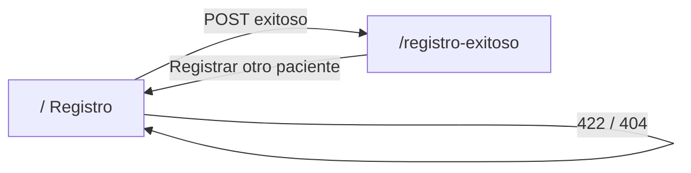
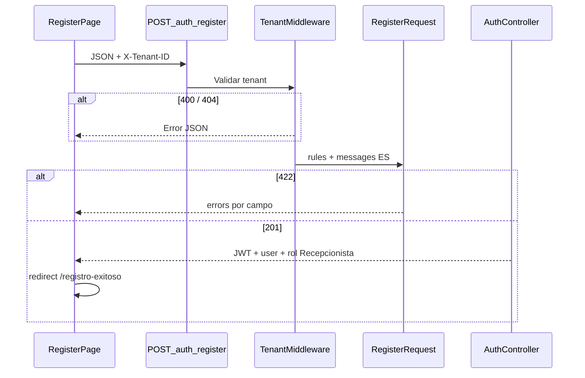

# Sprint 2 — Registro de usuarios (Implementación completa)

> **Documentación general del módulo:** [Sprint completo — Registro de usuarios](../registro-usuarios/README.md)  
> **Análisis previo (Sprint 1):** [sprint-01-registro-usuarios/README.md](../sprint-01-registro-usuarios/README.md)  
> **Guía de pruebas:** [PRUEBAS.md](./PRUEBAS.md)

**Módulo:** Registro de usuarios  
**Estado:** Completado  
**URL:** http://127.0.0.1:8000/

---

## 1. Objetivo del sprint

Implementar el módulo de **registro de usuarios/pacientes** de punta a punta:

1. Validaciones robustas en el **servidor** (Form Request, mensajes en español)
2. **UI/UX** PulseCare Medical (formulario de registro)
3. **Integración** frontend ↔ backend (Axios + Pinia)
4. Pantalla de **registro exitoso** con opción de registrar otro paciente
5. **Tests automatizados** y guía de pruebas manuales

---

## 2. Alcance entregado

| Fase | Entregable | Estado |
|------|------------|--------|
| Backend | `RegisterRequest` + refactor `AuthController` | Completado |
| Backend | 12 tests Feature en `AuthRegisterTest` | Completado |
| Frontend | `RegisterPage.vue` — UI PulseCare | Completado |
| Frontend | `RegisterSuccessPage.vue` — pantalla de éxito | Completado |
| Integración | `auth.register()` + mapeo errores API | Completado |
| UX | Flujo exclusivo: registro → éxito → otro paciente | Completado |
| Docs | README sprint + PRUEBAS.md | Completado |

---

## 3. Flujo de la aplicación



### Descripción paso a paso

1. El usuario abre **`/`** y completa el formulario PulseCare.
2. Validación **local** (`validateRegisterForm`) antes de llamar al API.
3. Si pasa, **`auth.register()`** envía `POST /api/v1/auth/register` con `X-Tenant-ID`.
4. **201** → redirect a **`/registro-exitoso`** con resumen del paciente registrado.
5. Botón **"Registrar otro paciente"** → cierra sesión (`clearSession`) y vuelve a **`/`**.

### Rutas activas

| Ruta | Componente | Descripción |
|------|------------|-------------|
| `/` | `RegisterPage` | Formulario de registro (pantalla principal) |
| `/registro-exitoso` | `RegisterSuccessPage` | Confirmación + registrar otro |
| `/register` | redirect → `/` | Alias |
| `/inicio`, `/login`, otras | redirect → `/` | Eliminadas del flujo |

> **Nota:** La app se sirve desde **Laravel** (`:8000`). El puerto `:5173` es solo Vite (hot reload).

---

## 4. Flujo técnico backend



---

## 5. Backend

### RegisterRequest

**Archivo:** `app/Http/Requests/Api/V1/RegisterRequest.php`

| Campo | Reglas |
|-------|--------|
| `name` | required, min:2, max:255, regex letras/espacios/guiones/apóstrofes |
| `email` | required, email:rfc, unique por `tenant_id` |
| `password` | required, confirmed, `Password::min(8)->mixedCase()->numbers()->symbols()` |

- Normalización: `trim(name)`, `lowercase(trim(email))`
- Mensajes de error en **español**

### AuthController

**Archivo:** `app/Http/Controllers/Api/V1/AuthController.php`

- Usa `RegisterRequest`
- Password hasheado por cast `'hashed'` del modelo `User`
- Asigna rol **`Recepcionista`**
- Devuelve JWT en respuesta 201

### API

```
POST /api/v1/auth/register
X-Tenant-ID: 00000000-0000-4000-8000-000000000001
```

```json
{
  "name": "María López",
  "email": "maria@example.com",
  "password": "Password1!",
  "password_confirmation": "Password1!"
}
```

| HTTP | Situación |
|------|-----------|
| 201 | Registro OK + JWT |
| 400 | Sin cabecera `X-Tenant-ID` |
| 404 | Tenant inexistente |
| 422 | Validación fallida (mensajes ES) |

---

## 6. Frontend

### Pantallas

| Archivo | Rol |
|---------|-----|
| `RegisterPage.vue` | Formulario PulseCare — 5 campos, validación local, llamada API |
| `RegisterSuccessPage.vue` | Éxito, resumen (nombre, email, rol), botón otro paciente |
| `AuthPageShell.vue` | Layout full-page con patrón médico de fondo |

### Store Pinia

**Archivo:** `resources/js/stores/auth.js`

```javascript
async register({ name, email, password, passwordConfirmation, tenantId }) {
    this.setTenantId(tenantId);
    const { data } = await api.post('/auth/register', {
        name, email, password,
        password_confirmation: passwordConfirmation,
    });
    this.persistSession(data);
    return data;
}
```

### Validación cliente

**Archivo:** `resources/js/modules/auth/composables/useRegisterValidation.js`

- `validateRegisterForm()` — reglas alineadas al backend
- `mapApiErrors()` — convierte respuesta 422 a errores por campo

### Router y guards

**Archivos:** `resources/js/router/index.js`, `guards.js`

- Solo rutas de registro y éxito
- Si hay token y se visita `/` → redirect a `/registro-exitoso`
- Si no hay token en éxito → redirect a `/`
- `App.vue` simplificado: solo `<router-view />` (sin nav lateral)

---

## 7. UI/UX — PulseCare Medical

| Elemento | Detalle |
|----------|---------|
| Marca | Logo `medical_services` + "PulseCare Medical" |
| Tipografía | Inter (Google Fonts) |
| Iconos | Material Symbols Outlined |
| Colores | Tokens en `resources/css/app.css` |
| Campos | Tenant UUID, nombre, email, contraseña, confirmación |
| Feedback | Banners error (rojo) animados; éxito en pantalla dedicada |
| Contraseña | Toggle mostrar/ocultar |

---

## 8. Campos del formulario

| # | Etiqueta | Envío | Notas |
|---|----------|-------|-------|
| 1 | ID de tenant (UUID) | Cabecera `X-Tenant-ID` | Demo: `00000000-0000-4000-8000-000000000001` |
| 2 | Nombre completo | `name` | Mín. 2 caracteres |
| 3 | Correo electrónico | `email` | Único por hospital |
| 4 | Contraseña | `password` | Mín. 8, mayúscula, minúscula, número, símbolo |
| 5 | Confirmar contraseña | `password_confirmation` | Debe coincidir |

**Ejemplo válido:** `Password1!`

---

## 9. Inventario de archivos

### Backend (creados / modificados)

| Archivo | Acción |
|---------|--------|
| `app/Http/Requests/Api/V1/RegisterRequest.php` | Creado |
| `app/Http/Controllers/Api/V1/AuthController.php` | Modificado |
| `tests/Feature/AuthRegisterTest.php` | Creado (12 tests) |

### Frontend (creados / modificados)

| Archivo | Acción |
|---------|--------|
| `resources/js/modules/auth/pages/RegisterPage.vue` | Creado |
| `resources/js/modules/auth/pages/RegisterSuccessPage.vue` | Creado |
| `resources/js/modules/auth/layouts/AuthPageShell.vue` | Creado |
| `resources/js/modules/auth/composables/useRegisterValidation.js` | Creado |
| `resources/js/stores/auth.js` | Modificado (`register()`) |
| `resources/js/router/index.js` | Modificado |
| `resources/js/router/guards.js` | Modificado |
| `resources/js/App.vue` | Simplificado |
| `resources/css/app.css` | Tokens PulseCare |
| `resources/views/app.blade.php` | Fuentes Inter + Material |
| `vite.config.js` | Redirect 5173 → 8000 |

### Documentación

| Archivo | Contenido |
|---------|-----------|
| `docs/sprints/sprint-02-registro-backend/README.md` | Este documento |
| `docs/sprints/sprint-02-registro-backend/PRUEBAS.md` | Casos de prueba |
| `docs/sprints/registro-usuarios/README.md` | Sprint completo consolidado |

---

## 10. Pruebas

### Automatizadas

```bash
php artisan test --filter=AuthRegister
```

**12 tests — 48 assertions**

| Tipo | Tests |
|------|-------|
| Positivos | Registro OK, email otro tenant, normalización email |
| Fallidos | Duplicado, contraseña débil, mismatch, nombre inválido, email inválido, campos vacíos, sin tenant, tenant desconocido |

### Manuales

Ver **[PRUEBAS.md](./PRUEBAS.md)** — casos UI (P1–P8, F1–F8) y cURL.

---

## 11. Cómo ejecutar

```bash
# Terminal 1
php artisan serve

# Terminal 2
npm run dev
```

Abrir: **http://127.0.0.1:8000/**

### Prueba rápida

1. Tenant: `00000000-0000-4000-8000-000000000001`
2. Nombre: `María López`
3. Email: único (ej. `paciente01@example.com`)
4. Contraseña: `Password1!` (confirmar igual)
5. **Registrarse** → pantalla de éxito → **Registrar otro paciente**

---

## 12. Decisiones técnicas

| Decisión | Elección |
|----------|----------|
| Validación backend | Form Request dedicado |
| Email unique | Scoped por `tenant_id` |
| Contraseña | Reglas fuertes Laravel `Password` |
| Flujo UI | Solo registro + éxito (sin home/login) |
| Post-registro | Pantalla dedicada, no redirect a dashboard |
| Otro paciente | `clearSession()` antes de nuevo registro |
| URL desarrollo | `:8000` (Laravel), no `:5173` directo |
| Errores | Español en Form Request + mapeo en Vue |

---

## 13. Historias de usuario cumplidas

| ID | Historia | Estado |
|----|----------|--------|
| US-01 | Registrarme con nombre, email y contraseña | Cumplido |
| US-02 | Ver errores claros si datos inválidos | Cumplido |
| US-03 | Saber si email ya está registrado | Cumplido |
| US-04 | Confirmación visual tras registro exitoso | Cumplido |
| US-05 | Registrar otro paciente sin salir del módulo | Cumplido |
| US-06 | UI profesional dominio médico (PulseCare) | Cumplido |

---

## 14. Referencias

| Recurso | Ubicación |
|---------|-----------|
| Sprint completo | [../registro-usuarios/README.md](../registro-usuarios/README.md) |
| Sprint 1 (análisis) | [../sprint-01-registro-usuarios/README.md](../sprint-01-registro-usuarios/README.md) |
| Guía de pruebas | [PRUEBAS.md](./PRUEBAS.md) |
| Form Request | `app/Http/Requests/Api/V1/RegisterRequest.php` |
| Tests | `tests/Feature/AuthRegisterTest.php` |

---

*Sprint 2 — Registro de usuarios. Implementación completa: backend, UI PulseCare, integración FE-BE y flujo registro → éxito → otro paciente.*
