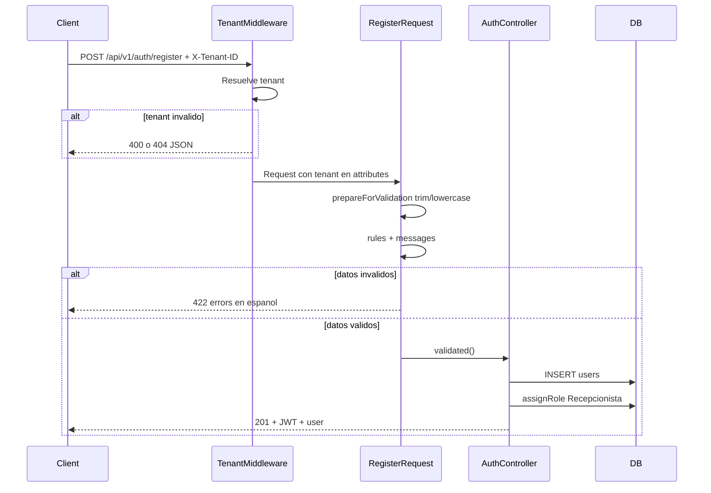

# Sprint 2 — Registro de usuarios (Backend)

**Módulo:** Registro de usuarios  
**Alcance del sprint:** Validaciones del lado del servidor para `POST /api/v1/auth/register`  
**Estado:** Backend completado · Frontend pendiente  
**Documento base (análisis):** [Sprint 1 — Registro de usuarios](../sprint-01-registro-usuarios/README.md)

---

## 1. Objetivo del sprint

Fortalecer el endpoint de registro existente con:

- Validaciones robustas y centralizadas en un **Form Request**
- Mensajes de error **en español**
- Email **único por tenant** (evitar error 500 por restricción SQL)
- Contraseña **fuerte** con confirmación obligatoria
- **Tests automatizados** que cubran los casos críticos

---

## 2. Resumen de avance

| Área | Estado | Detalle |
|------|--------|---------|
| Form Request (`RegisterRequest`) | Completado | Reglas, normalización, mensajes ES |
| Controlador (`AuthController@register`) | Completado | Refactorizado para usar Form Request |
| Tests Feature | Completado | 8 tests, 35 assertions |
| Documentación | Completado | Este README |
| Frontend (`RegisterPage.vue`) | Pendiente | Sprint siguiente |

---

## 3. Flujo implementado



---

## 4. Archivos creados y modificados

### Creados

| Archivo | Propósito |
|---------|-----------|
| [`app/Http/Requests/Api/V1/RegisterRequest.php`](../../../app/Http/Requests/Api/V1/RegisterRequest.php) | Validación centralizada del registro |
| [`tests/Feature/AuthRegisterTest.php`](../../../tests/Feature/AuthRegisterTest.php) | Tests del endpoint de registro |
| `docs/sprints/sprint-02-registro-backend/README.md` | Documentación del sprint |

### Modificados

| Archivo | Cambio |
|---------|--------|
| [`app/Http/Controllers/Api/V1/AuthController.php`](../../../app/Http/Controllers/Api/V1/AuthController.php) | `register()` usa `RegisterRequest`; password sin `Hash::make()` manual |

### Sin cambios

- `routes/api.php` — la ruta ya existía
- Migraciones — el esquema de BD del Sprint 1 es suficiente
- `TenantMiddleware.php` — sin modificaciones
- Frontend Vue — pendiente para el siguiente sprint

---

## 5. Antes vs después

### Antes (Sprint 1 — estado base)

```php
$validated = $request->validate([
    'name' => ['required', 'string', 'max:255'],
    'email' => ['required', 'email', 'max:255'],
    'password' => ['required', 'string', 'min:8', 'confirmed'],
]);
// Email duplicado → error SQL 500
// Mensajes de validación en inglés (default Laravel)
// Hash::make() manual en el controlador
```

### Después (Sprint 2 — implementado)

- Validación extraída a `RegisterRequest`
- Email único scoped por `tenant_id` → respuesta **422** clara
- Contraseña fuerte: `Password::min(8)->mixedCase()->numbers()->symbols()`
- Normalización: `name` con trim, `email` en minúsculas
- Mensajes personalizados en español
- Hash delegado al cast `'password' => 'hashed'` del modelo `User`

---

## 6. Reglas de validación (servidor)

| Campo | Reglas Laravel | Descripción |
|-------|----------------|-------------|
| `name` | `required`, `string`, `min:2`, `max:255`, regex Unicode | Nombre legible; letras, espacios, `-`, `'` |
| `email` | `required`, `string`, `email:rfc`, `max:255`, `Rule::unique(...)->where(tenant_id)` | Correo válido y único **por hospital** |
| `password` | `required`, `string`, `confirmed`, `Password::min(8)->mixedCase()->numbers()->symbols()` | Contraseña fuerte + confirmación |
| `password_confirmation` | (implícito por `confirmed`) | Debe coincidir con `password` |

### Normalización automática (`prepareForValidation`)

| Campo | Transformación |
|-------|------------------|
| `name` | `trim()` |
| `email` | `Str::lower(trim())` |

### Reglas de negocio (sin cambio)

- El `tenant_id` **no** viene en el body; lo resuelve `TenantMiddleware` desde `X-Tenant-ID`
- Rol asignado automáticamente: **`Recepcionista`**
- Tras registro exitoso se emite **JWT** (login automático)

---

## 7. Campos del formulario (referencia para frontend)

El formulario de registro (Sprint 3 — frontend) debe incluir:

| # | Etiqueta UI | Campo API | Tipo | Notas |
|---|-------------|-----------|------|-------|
| 1 | ID de tenant | *(cabecera `X-Tenant-ID`)* | text | Mismo patrón que `LoginPage.vue` |
| 2 | Nombre completo | `name` | text | Mín. 2 caracteres |
| 3 | Correo electrónico | `email` | email | Único por hospital |
| 4 | Contraseña | `password` | password | Ver reglas fuertes abajo |
| 5 | Confirmar contraseña | `password_confirmation` | password | Debe coincidir |

**Ejemplo de contraseña válida:** `Password1!`

**No incluir en el formulario:** rol (asignado en servidor), `tenant_id` en body.

---

## 8. Contrato del API

### Request

```
POST /api/v1/auth/register
Content-Type: application/json
Accept: application/json
X-Tenant-ID: 00000000-0000-4000-8000-000000000001
```

```json
{
  "name": "María López",
  "email": "maria@example.com",
  "password": "Password1!",
  "password_confirmation": "Password1!"
}
```

### Respuesta exitosa — 201 Created

```json
{
  "access_token": "eyJ0eXAiOiJKV1QiLCJhbGc...",
  "token_type": "bearer",
  "expires_in": 3600,
  "user": {
    "id": 1,
    "tenant_id": "00000000-0000-4000-8000-000000000001",
    "name": "María López",
    "email": "maria@example.com",
    "roles": [{ "name": "Recepcionista" }],
    "tenant": { "name": "Hospital General San Marcos (demo)", ... }
  }
}
```

### Respuestas de error

| HTTP | Origen | Ejemplo |
|------|--------|---------|
| 400 | `TenantMiddleware` | `"La cabecera X-Tenant-ID es obligatoria."` |
| 404 | `TenantMiddleware` | `"Tenant no encontrado."` |
| 422 | `RegisterRequest` | `{ "message": "...", "errors": { "campo": ["..."] } }` |

#### Ejemplos 422

**Email duplicado en el mismo hospital:**
```json
{
  "message": "El correo electrónico ya está registrado en este hospital.",
  "errors": {
    "email": ["El correo electrónico ya está registrado en este hospital."]
  }
}
```

**Contraseña débil:**
```json
{
  "message": "La contraseña debe tener al menos 8 caracteres e incluir mayúsculas, minúsculas, números y un símbolo.",
  "errors": {
    "password": ["La contraseña debe tener al menos 8 caracteres e incluir mayúsculas, minúsculas, números y un símbolo."]
  }
}
```

**Contraseñas no coinciden:**
```json
{
  "message": "Las contraseñas no coinciden.",
  "errors": {
    "password": ["Las contraseñas no coinciden."]
  }
}
```

**Nombre inválido (muy corto):**
```json
{
  "message": "El nombre debe tener al menos 2 caracteres.",
  "errors": {
    "name": ["El nombre debe tener al menos 2 caracteres."]
  }
}
```

---

## 9. Tests automatizados

**Archivo:** `tests/Feature/AuthRegisterTest.php`

| Test | Qué verifica |
|------|--------------|
| `test_register_creates_user_and_returns_token` | 201, JWT, rol Recepcionista, persistencia en BD |
| `test_register_rejects_duplicate_email_in_same_tenant` | 422 con mensaje de email duplicado |
| `test_register_allows_same_email_in_different_tenant` | Mismo email en otro tenant → 201 |
| `test_register_rejects_weak_password` | 422 en campo password |
| `test_register_rejects_password_confirmation_mismatch` | 422 "Las contraseñas no coinciden." |
| `test_register_rejects_invalid_name` | 422 en campo name |
| `test_register_requires_tenant_header` | 400 sin `X-Tenant-ID` |
| `test_register_normalizes_email_to_lowercase` | `Maria@Example.COM` → `maria@example.com` |

### Ejecutar tests

```bash
# Solo registro
php artisan test --filter=AuthRegister

# Suite completa
php artisan test
```

**Resultado actual:** 10 tests pasando (8 de registro + 2 existentes).

---

## 10. Prueba manual (cURL)

**Tenant demo:**
```
00000000-0000-4000-8000-000000000001
```

**Registro exitoso:**
```bash
curl -X POST http://127.0.0.1:8000/api/v1/auth/register \
  -H "Content-Type: application/json" \
  -H "Accept: application/json" \
  -H "X-Tenant-ID: 00000000-0000-4000-8000-000000000001" \
  -d "{\"name\":\"María López\",\"email\":\"maria@example.com\",\"password\":\"Password1!\",\"password_confirmation\":\"Password1!\"}"
```

**Email duplicado (segunda vez con mismo email):**
```bash
# Misma petición → 422
```

**Contraseña débil:**
```bash
curl -X POST http://127.0.0.1:8000/api/v1/auth/register \
  -H "Content-Type: application/json" \
  -H "X-Tenant-ID: 00000000-0000-4000-8000-000000000001" \
  -d "{\"name\":\"Test User\",\"email\":\"otro@example.com\",\"password\":\"password\",\"password_confirmation\":\"password\"}"
```

---

## 11. Decisiones técnicas

| Decisión | Elección | Motivo |
|----------|----------|--------|
| Validación | Form Request dedicado | Separación de responsabilidades; reutilizable y testeable |
| Email | `email:rfc` (sin DNS) | Evita fallos en entorno de tests sin resolución DNS |
| Unique email | Scoped por `tenant_id` | Alineado con restricción BD `UNIQUE(tenant_id, email)` |
| Contraseña | Reglas fuertes Laravel `Password` | Requisito del sprint: mayúscula, minúscula, número, símbolo |
| Hash password | Cast `hashed` en modelo | Evita doble hash; convención Laravel 12 |
| Rol al registrar | `Recepcionista` fijo | Sin cambio respecto al Sprint 1 |
| Idioma errores | Español en Form Request | Sin archivos `lang/` globales por ahora |

---

## 12. Pendiente — Sprint 3 (frontend)

| Tarea | Archivo estimado |
|-------|------------------|
| Crear pantalla de registro | `resources/js/modules/auth/pages/RegisterPage.vue` |
| Acción `register()` en store | `resources/js/stores/auth.js` |
| Ruta `/register` | `resources/js/router/index.js` |
| Enlace login ↔ registro | `LoginPage.vue` + `RegisterPage.vue` |
| Errores 422 por campo | Componente de registro |
| Redirect a home tras 201 | Store + router |

---

## 13. Referencias cruzadas

| Recurso | Ubicación |
|---------|-----------|
| Análisis BD y arquitectura | [Sprint 1 README](../sprint-01-registro-usuarios/README.md) |
| Form Request | `app/Http/Requests/Api/V1/RegisterRequest.php` |
| Controlador | `app/Http/Controllers/Api/V1/AuthController.php` |
| Tests | `tests/Feature/AuthRegisterTest.php` |
| Login (referencia UI) | `resources/js/modules/auth/pages/LoginPage.vue` |
| README proyecto | `README.md` (raíz) |

---

*Sprint 2 — Backend de registro de usuarios. Última actualización: implementación de validaciones y tests completada.*
