# Sprint 3 — UML del módulo Registro de usuarios

**Módulo:** Registro de usuarios  
**Estado:** Completado (último sprint)  
**Alcance:** Diagramas de clases y de secuencia del módulo implementado

> **Sprints anteriores:** [Sprint 1 — Análisis](../sprint-01-registro-usuarios/README.md) · [Sprint 2 — Implementación](../sprint-02-registro-backend/README.md) · [Sprint completo](../registro-usuarios/README.md)

---

## 1. Objetivo del sprint

Documentar la arquitectura del módulo de registro mediante:

- **Diagrama de clases** — entidades, capas backend y componentes frontend
- **Diagramas de secuencia** — flujos principales: registro exitoso, validación fallida y registrar otro paciente

---

## 2. Diagrama de clases — Backend (Laravel)

Representa las clases PHP involucradas en `POST /api/v1/auth/register`.


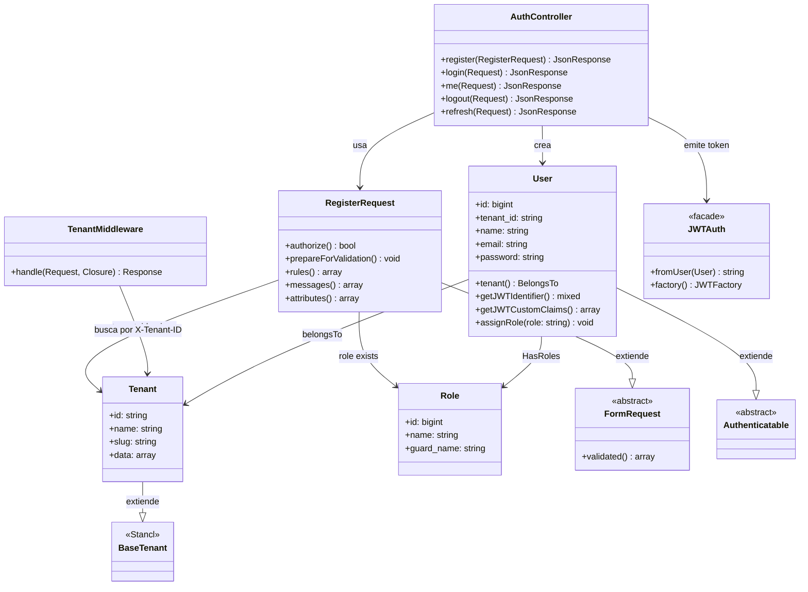

### Relaciones con base de datos (Spatie Permission)

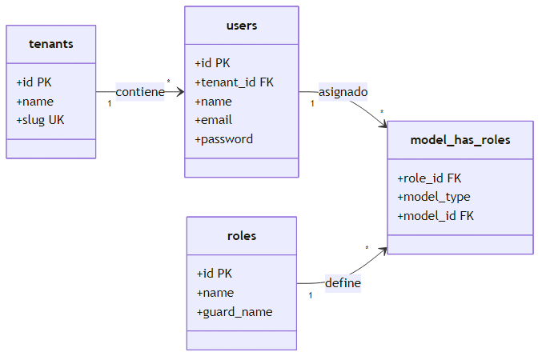

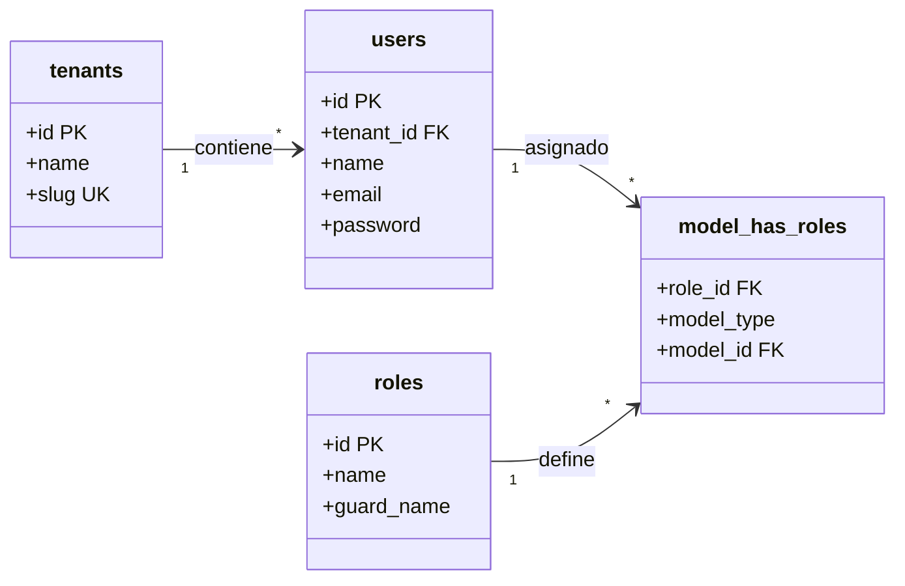

---

## 3. Diagrama de clases — Frontend (Vue 3)

Componentes y módulos del flujo de registro en el cliente.

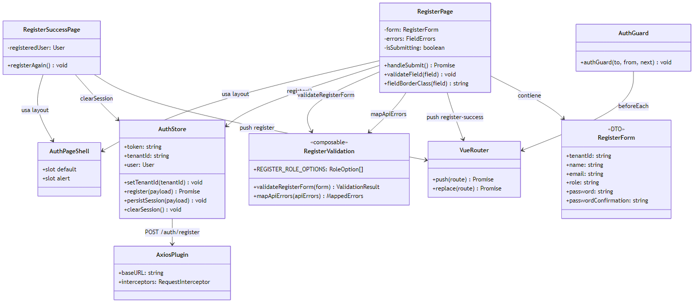

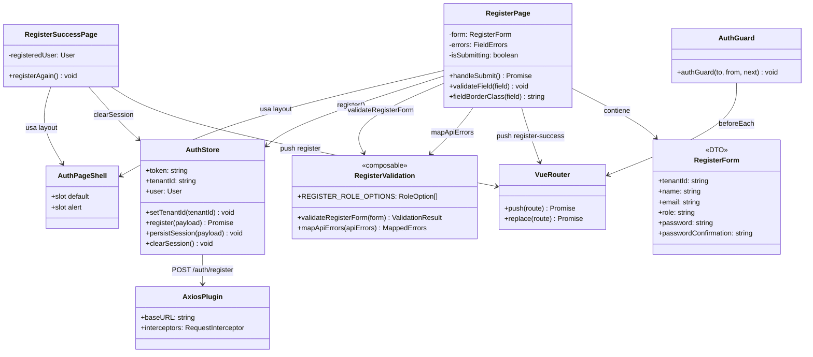

---

## 4. Diagrama de secuencia — Registro exitoso

Flujo completo desde el formulario hasta la pantalla de éxito.

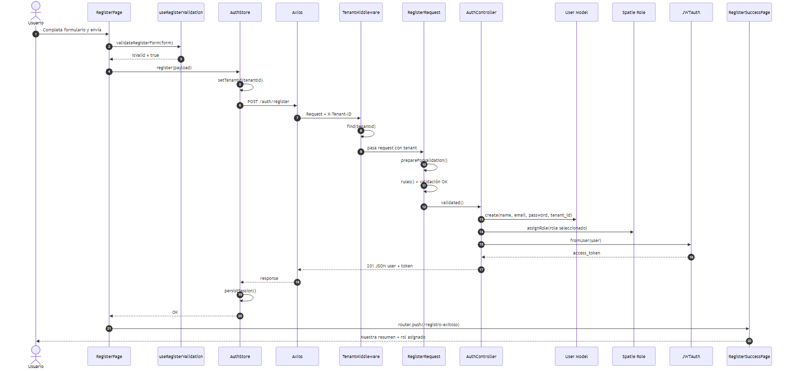

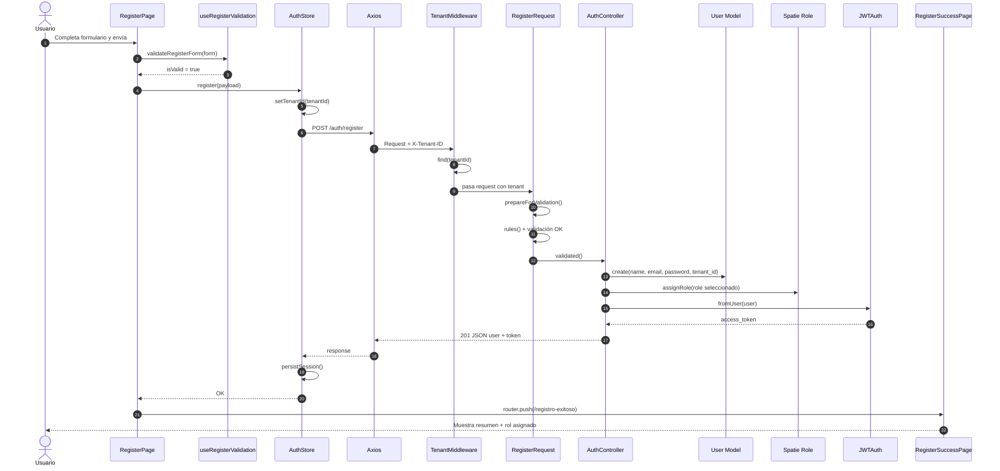

---

## 5. Diagrama de secuencia — Validación fallida (422)

Cuando el servidor rechaza los datos (email duplicado, contraseña débil, rol inválido, etc.).

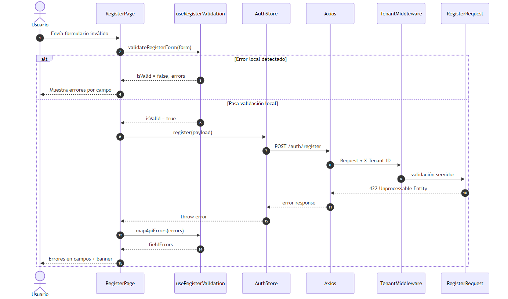

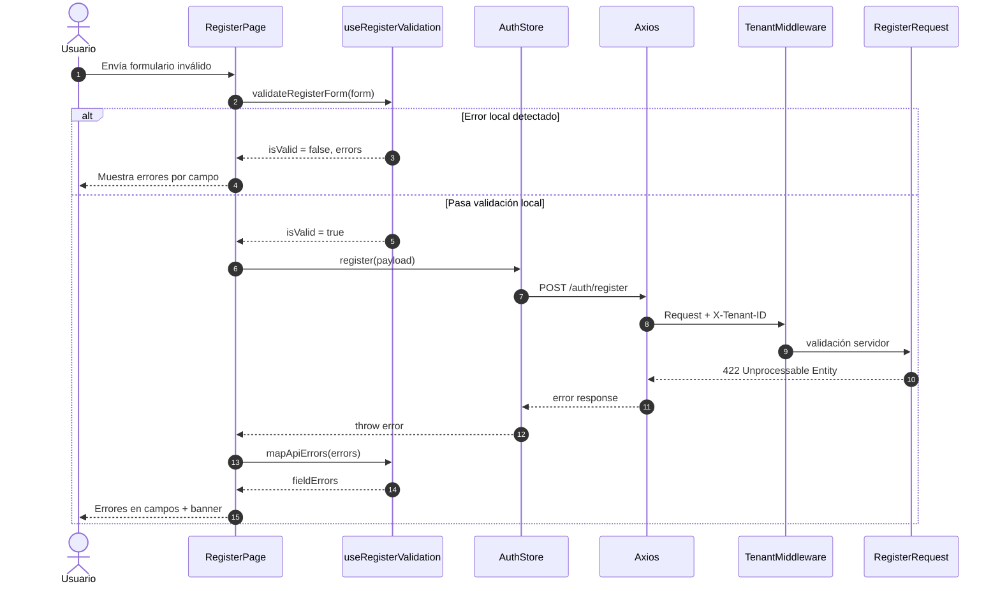

---

## 6. Diagrama de secuencia — Tenant inválido (404)

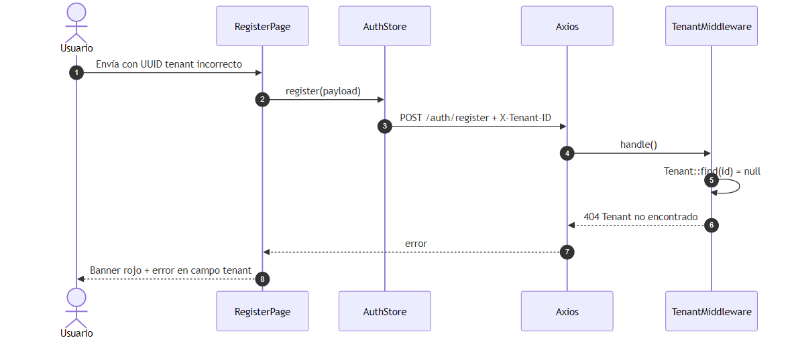

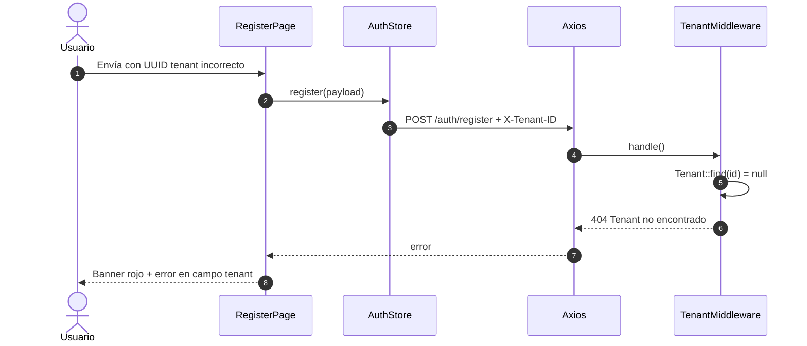

---

## 7. Diagrama de secuencia — Registrar otro paciente

Flujo desde la pantalla de éxito de vuelta al formulario.


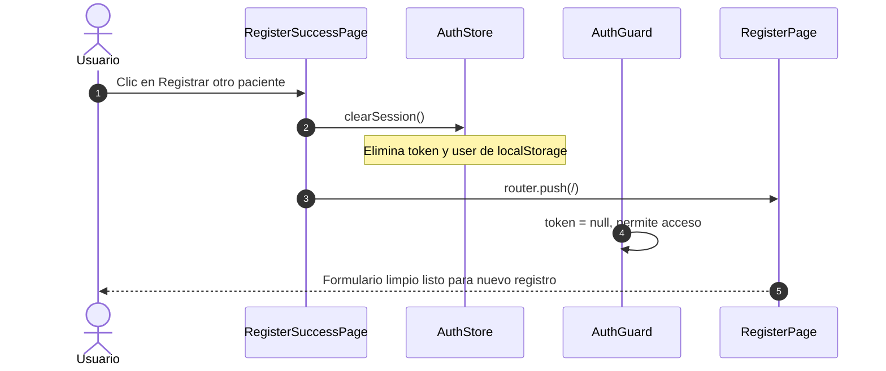

---

## 8. Diagrama de secuencia — Vista general FE ↔ BE

Resumen de capas en una sola interacción.

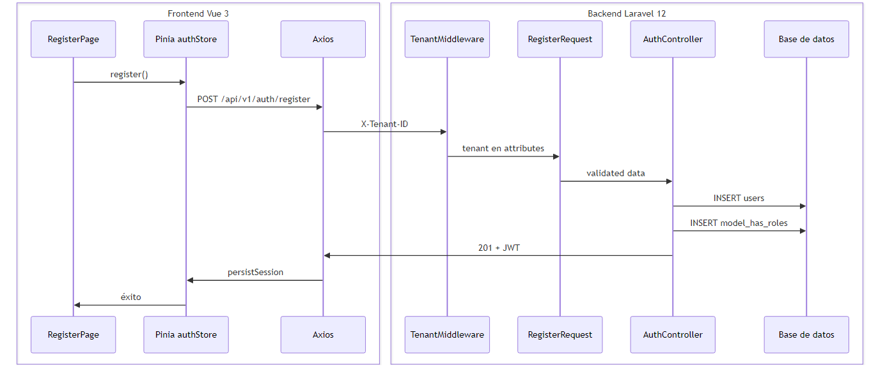

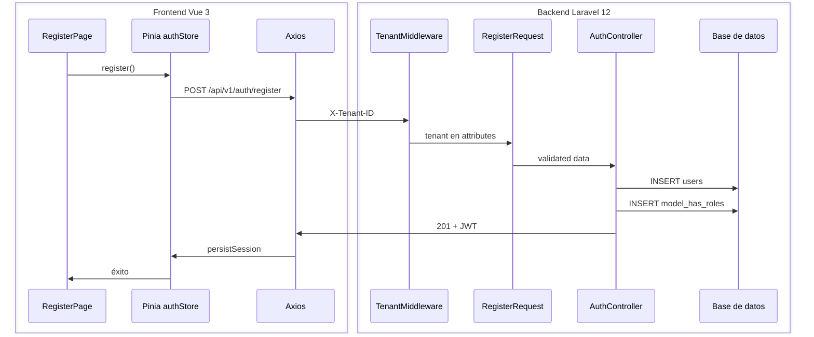

---

## 9. Leyenda de clases por capa

| Capa | Clases / archivos |
|------|-------------------|
| **Presentación (Vue)** | `RegisterPage.vue`, `RegisterSuccessPage.vue`, `AuthPageShell.vue` |
| **Estado (Pinia)** | `stores/auth.js` → `AuthStore` |
| **Validación cliente** | `composables/useRegisterValidation.js` |
| **HTTP** | `plugins/axios.js` |
| **Routing** | `router/index.js`, `router/guards.js` |
| **Controlador** | `AuthController` |
| **Validación servidor** | `RegisterRequest` |
| **Middleware** | `TenantMiddleware` |
| **Dominio** | `User`, `Tenant`, `Role` (Spatie) |
| **Auth** | `JWTAuth` (tymon/jwt-auth) |

---

## 10. Roles disponibles en el registro

| Rol (`role`) | Asignación |
|--------------|------------|
| Recepcionista | Valor por defecto en UI |
| Médico | Seleccionable |
| Enfermera | Seleccionable |
| TecnicoLab | Seleccionable |
| Admin | Seleccionable |

Validados con `Rule::exists('roles', 'name')` en `RegisterRequest`.

---

## 11. Imágenes exportadas (PNG)

Todas las imágenes están en la carpeta [`images/`](images/):

| # | Archivo | Descripción |
|---|---------|-------------|
| 1 | [01-class-backend.png](images/01-class-backend.png) | Clases backend Laravel |
| 2 | [02-class-database.png](images/02-class-database.png) | Tablas BD + Spatie |
| 3 | [03-class-frontend.png](images/03-class-frontend.png) | Clases frontend Vue |
| 4 | [04-sequence-registro-exitoso.png](images/04-sequence-registro-exitoso.png) | Secuencia registro OK |
| 5 | [05-sequence-validacion-fallida.png](images/05-sequence-validacion-fallida.png) | Secuencia error 422 |
| 6 | [06-sequence-tenant-invalido.png](images/06-sequence-tenant-invalido.png) | Secuencia error 404 |
| 7 | [07-sequence-registrar-otro.png](images/07-sequence-registrar-otro.png) | Secuencia otro paciente |
| 8 | [08-sequence-vista-general.png](images/08-sequence-vista-general.png) | Secuencia vista general |

Los archivos fuente Mermaid están en [`diagrams/`](diagrams/) por si necesitas regenerarlas con:

```bash
npx @mermaid-js/mermaid-cli -i diagrams/01-class-backend.mmd -o images/01-class-backend.png -b white
```

---

## 12. Referencias

| Recurso | Ubicación |
|---------|-----------|
| Sprint 2 — Implementación | [../sprint-02-registro-backend/README.md](../sprint-02-registro-backend/README.md) |
| Sprint completo | [../registro-usuarios/README.md](../registro-usuarios/README.md) |
| Pruebas | [../sprint-02-registro-backend/PRUEBAS.md](../sprint-02-registro-backend/PRUEBAS.md) |

---

*Sprint 3 — Diagramas UML (clases y secuencia) del módulo Registro de usuarios.*
